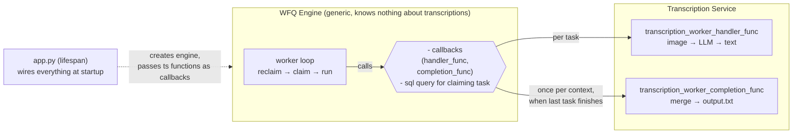

```mermaid
flowchart LR
    app["app.py (lifespan)<br/>wires everything at startup"]

    subgraph engine["WFQ Engine (generic, knows nothing about transcriptions)"]
        direction TB
        worker["worker loop<br/>reclaim → claim → run"]
        cb{{"- callbacks<br/>(handler_func,<br/>completion_func)<br/>- sql query for claiming task"}}
        worker -->|"calls"| cb
    end

    subgraph ts["Transcription Service"]
        direction TB
        handler["transcription_worker_handler_func<br/>image → LLM → text"]
        completion["transcription_worker_completion_func<br/>merge → output.txt"]
    end

    app -.->|"creates engine,<br/>passes ts functions as callbacks"| engine
    cb -->|"per task"| handler
    cb -->|"once per context,<br/>when last task finishes"| completion
```